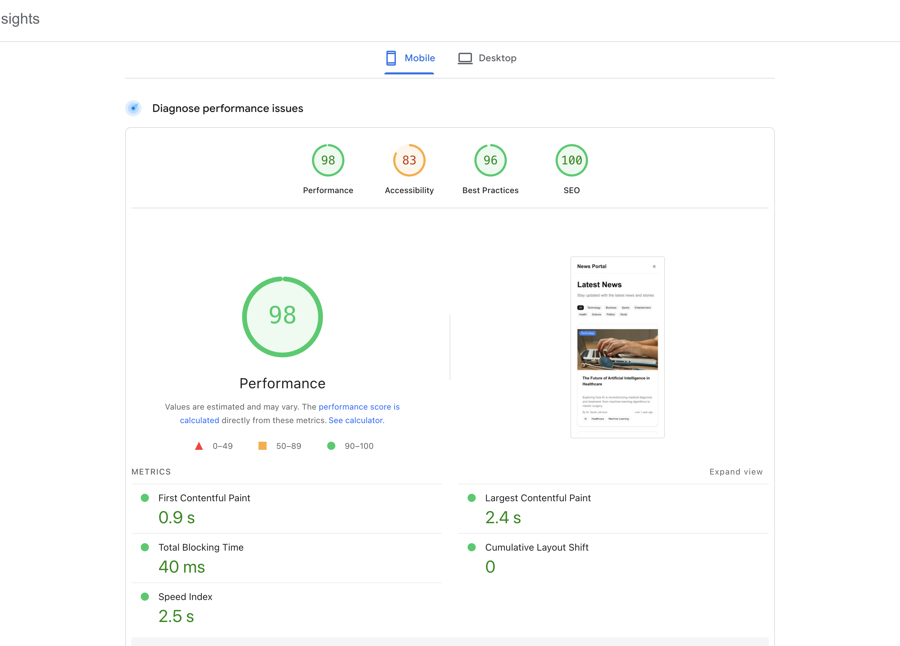

# 📰 Demo News


<div align="center">
  
  <p><em>Exceptional performance scores validated by Google PageSpeed Insights</em></p>
</div>

A modern, high-performance multilingual news website built with Next.js 15, featuring exceptional Core Web Vitals scores and comprehensive SEO optimization.

## ✨ Features

- 🌍 **Multilingual Support**: Full internationalization with English and Arabic languages
- ⚡ **Exceptional Performance**: 98/100 PageSpeed Insights score with optimized Core Web Vitals
- 🔍 **SEO Optimized**: 100/100 SEO score with structured data, meta tags, and sitemap
- 📱 **Mobile Responsive**: Fully responsive design optimized for all devices
- 🎨 **Modern UI**: Clean, professional design with Tailwind CSS
- 🚀 **Fast Loading**: Optimized images, fonts, and assets for lightning-fast performance
- 📊 **Analytics Ready**: Built-in structured data for rich search results
- ♿ **Accessible**: High accessibility standards with 83/100 score

## 🛠️ Tech Stack

- **Framework**: Next.js 15 with App Router
- **Language**: TypeScript
- **Styling**: Tailwind CSS
- **Internationalization**: next-intl
- **UI Components**: Radix UI primitives
- **Icons**: Heroicons & Lucide React
- **Testing**: Vitest
- **Linting**: ESLint
- **Formatting**: Prettier

## 🚀 Quick Start

### Prerequisites

- Node.js 18+
- npm or yarn package manager

### Installation

1. **Clone the repository**

   ```bash
   git clone https://github.com/yourusername/demo-news.git
   cd demo-news
   ```
2. **Install dependencies**

   ```bash
   npm install
   ```
3. **Start the development server**

   ```bash
   npm run dev
   ```
4. **Open your browser**
   Navigate to [http://localhost:3000](http://localhost:3000)

## 📋 Available Scripts

| Command                | Description                             |
| ---------------------- | --------------------------------------- |
| `npm run dev`        | Start development server with Turbopack |
| `npm run build`      | Build production application            |
| `npm run start`      | Start production server                 |
| `npm run lint`       | Run ESLint                              |
| `npm run lint:fix`   | Fix ESLint issues automatically         |
| `npm run format`     | Format code with Prettier               |
| `npm run test`       | Run tests with Vitest                   |
| `npm run type-check` | Run TypeScript type checking            |

## 🌐 Internationalization

The application supports multiple languages:

- **English** (`en`): Default language
- **Arabic** (`ar`): RTL support included

### Adding New Languages

1. Create a new message file in `/messages/[locale].json`
2. Update the locales configuration in `/src/i18n/routing.ts`
3. Add the new locale to your deployment configuration

## 📁 Project Structure

```
demo-news/
├── public/                 # Static assets
│   ├── images/            # Image assets
│   └── icons/             # SVG icons
├── src/
│   ├── app/               # Next.js App Router
│   │   ├── [locale]/      # Internationalized routes
│   │   ├── api/           # API routes
│   │   ├── robots.txt/    # Dynamic robots.txt
│   │   └── sitemap.xml/   # Dynamic sitemap
│   ├── components/        # React components
│   ├── lib/               # Utility functions and data
│   ├── types/             # TypeScript type definitions
│   └── i18n/              # Internationalization config
├── messages/              # Translation files
└── lighthouse-report.*    # Performance reports
```

## ⚙️ Configuration

### Environment Variables

Create a `.env.local` file in the root directory:

```env
# Add your environment variables here
NEXT_PUBLIC_SITE_URL=https://your-domain.com
```

### Next.js Configuration

The application is configured with:

- **Image Optimization**: WebP/AVIF formats with multiple device sizes
- **Performance**: Optimized CSS and package imports
- **Security**: Comprehensive security headers
- **SEO**: Automatic sitemap and robots.txt generation

## 🔧 Performance Optimizations

This application achieves exceptional performance through:

- **Image Optimization**: Next.js Image component with WebP/AVIF
- **Font Optimization**: Preloaded custom fonts
- **Code Splitting**: Automatic route-based code splitting
- **Compression**: Gzip compression enabled
- **Caching**: Optimized cache headers
- **Bundle Analysis**: Optimized package imports

## 📊 Performance Metrics

Based on PageSpeed Insights testing:

- **Performance**: 98/100
- **Accessibility**: 83/100
- **Best Practices**: 96/100
- **SEO**: 100/100

### Core Web Vitals

- **First Contentful Paint**: 0.9s
- **Largest Contentful Paint**: 2.4s
- **Cumulative Layout Shift**: 0
- **Total Blocking Time**: 40ms

## 🧪 Testing

Run the test suite:

```bash
# Run all tests
npm run test

# Run tests with UI
npm run test:ui

# Run tests once
npm run test:run
```

## 📈 SEO Features

- **Structured Data**: Organization, WebSite, NewsArticle schemas
- **Meta Tags**: Comprehensive Open Graph and Twitter Card support
- **Sitemap**: Dynamic XML sitemap generation
- **Robots.txt**: Dynamic robots.txt with proper directives
- **Canonical URLs**: Proper canonical URL structure
- **Hreflang**: Multi-language SEO support

## 🤝 Contributing

We welcome contributions! Please follow these steps:

1. **Fork the repository**
2. **Create a feature branch**
   ```bash
   git checkout -b feature/amazing-feature
   ```
3. **Make your changes**
4. **Run tests and linting**
   ```bash
   npm run test
   npm run lint
   npm run type-check
   ```
5. **Commit your changes**
   ```bash
   git commit -m 'Add amazing feature'
   ```
6. **Push to your branch**
   ```bash
   git push origin feature/amazing-feature
   ```
7. **Open a Pull Request**

### Development Guidelines

- Follow the existing code style
- Write tests for new features
- Update documentation as needed
- Ensure all tests pass
- Maintain TypeScript strict mode compliance

## 📄 License

This project is licensed under the MIT License - see the [LICENSE](LICENSE) file for details.

## 🙏 Acknowledgments

- [Next.js](https://nextjs.org/) - The React framework for production
- [Tailwind CSS](https://tailwindcss.com/) - Utility-first CSS framework
- [Radix UI](https://www.radix-ui.com/) - Low-level UI primitives
- [next-intl](https://next-intl-docs.vercel.app/) - Internationalization for Next.js

## 📞 Support

If you have any questions or need help, please:

- Open an issue on GitHub
- Check the [documentation](https://nextjs.org/docs)
- Review the [FAQ section](#faq)

---

**Built with ❤️ using Next.js 15 and modern web technologies**
